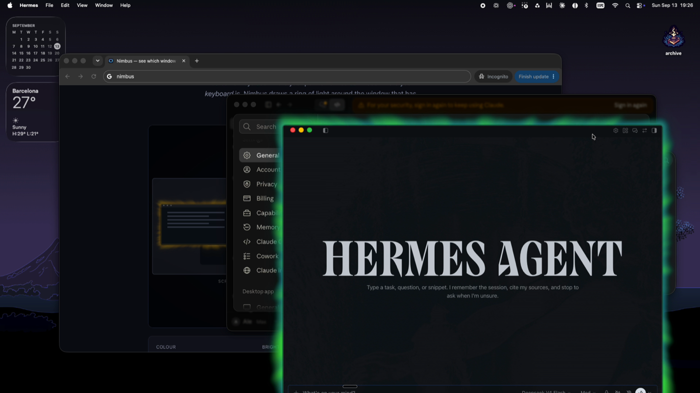
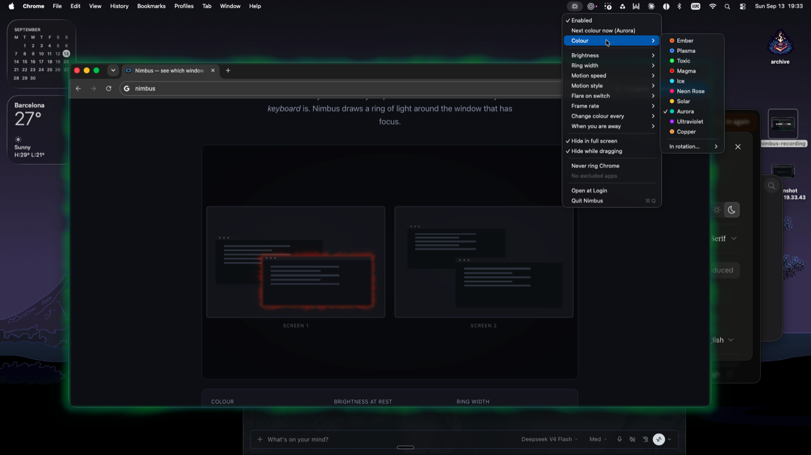
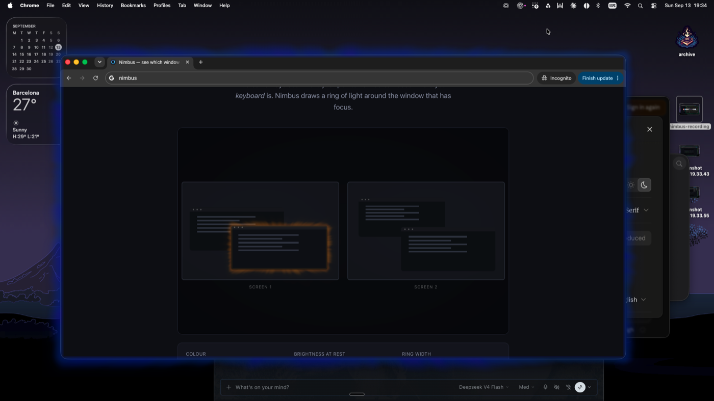

# Nimbus

**macOS hides which window has keyboard focus. Nimbus makes it obvious.**

You can always see where your pointer is. You cannot see where your *keyboard*
is. macOS marks the focused window with a slightly darker title bar, which is
invisible in practice on a large display and hopeless across several. So you
come back to the machine, start typing, press Enter — and it goes to the wrong
window.

Nimbus draws a ring of light around the window that currently has keyboard
focus. It moves constantly, so your eye keeps registering it, and it pulses
brighter for a moment whenever focus changes.



<!-- VIDEO GOES HERE.
     Edit this file on github.com and drag docs/demo.mp4 into the editor at this
     spot. GitHub uploads it to its own asset host and inserts a URL that plays
     inline. A <video> tag pointing at a file in this repository does not work:
     GitHub's markdown renderer strips it. Delete this comment afterwards. -->

**[Try it in your browser](https://vivosai.github.io/nimbus/)** — a live
simulation of two displays, no install and no permissions needed.

It is built around a quirk of perception: **your eye stops seeing what never
changes.** So the ring never stops moving, and its color scheme rotates — a
static marker would work beautifully for a week and be invisible by the end of
the month.

## Install

Requires macOS 13 Ventura or later. Apple Silicon and Intel.

With [Homebrew](https://brew.sh):

```sh
brew install --cask vivosAi/tap/nimbus
```

Or download the latest `.dmg` from [Releases](../../releases), open it, and drag
Nimbus to Applications.

Signed and notarized, so it opens without Gatekeeper warnings either way.

<details>
<summary>Two things Homebrew may say that are not about Nimbus</summary>

**"The following taps are not trusted"** — Homebrew now asks you to trust
third-party taps before it will run their casks. Installing by the full name
above trusts this one cask. To be explicit:

```sh
brew trust --cask vivosAi/tap/nimbus
```

**"We do not provide support for this platform... macOS on Intel x86_64"** —
that is Homebrew withdrawing support for Intel Macs, announced in 2025. It is
not about Nimbus, which is a universal binary and runs natively on both Intel
and Apple Silicon. Intel users can ignore it, or install from the `.dmg`
instead and avoid Homebrew entirely.

</details>

On first launch Nimbus asks for **Accessibility** permission. It cannot work
without it — see [What it can see](#what-it-can-see) below for exactly what that
does and does not allow. Tick the box in System Settings and Nimbus starts
within a second; no restart needed.

To update later, either `brew upgrade --cask nimbus`, or download the new
`.dmg` and drag it over the old app. Your Accessibility permission carries
across an update: macOS keys it to the bundle identifier and the signing
certificate, and both stay the same between versions.

## Using it

Everything is in the menu bar icon.



| | |
|---|---|
| **Color** | Pick a palette, or choose which ones the timer rotates through |
| **Brightness** | How bright the ring sits between focus changes |
| **Ring width** | Thin, normal or thick |
| **Motion speed** | How fast the light travels around the ring |
| **Motion style** | Broad slow swells, or fine churn |
| **Flare on switch** | How long the bright pulse lasts when focus changes |
| **Frame rate** | Peak rate; it halves automatically once the ring settles |
| **Change color every** | The color rotates so you never stop noticing it |
| **Hide in full screen** / **Hide while dragging** | |
| **Excluded apps** | Apps that never get a ring |
| **Open at Login** | |

The ring hides itself while you drag or resize a window — you already know which
window you are dragging — and returns when it comes to rest.

Ten color schemes, rotating on a timer so the ring never becomes wallpaper:




## What it can see

Nimbus asks for Accessibility permission, which is the most powerful thing a Mac
app can request. Here is precisely what it does with it. All of this is
checkable in this repository.

**It only ever reads.** The only Accessibility call it makes that touches
another app is `AXUIElementCopyAttributeValue`. There is no
`AXUIElementSetAttributeValue`, no `AXUIElementPerformAction`, and no synthetic
keyboard or mouse events anywhere in the source.

**It reads six attributes, and no others:**

- the focused window, and a window's parent
- a window's position and size
- a window's role and subrole (to tell a real window from a sheet or a popover)

That is the complete list. Not window titles. Not text. Not contents.

**It does not:**

- record or screenshot the screen (it never asks for Screen Recording)
- read what you type — the one input-related call returns *how many seconds ago*
  you last touched the machine, never what you pressed
- move, resize or close anything
- make any network connection of any kind

Why Accessibility at all? It is the only supported way to find out which window
has keyboard focus. The alternative, `CGWindowListCopyWindowInfo`, cannot report
focus, only stacking order — and is increasingly gated behind Screen Recording,
which is a far more invasive permission.

To uninstall: quit Nimbus and delete the app. The only thing left behind is
`~/Library/Preferences/io.github.vivosai.nimbus.plist`.

## Build

```sh
make test      # unit tests
make dev       # fast local build, signed, into build/Nimbus.app
make dev-run   # build and launch
make bundle    # universal release build (arm64 + x86_64)
make icon      # regenerate the app icon from Tools/make-icon.swift
```

No Xcode Metal toolchain is needed — the shader is compiled at runtime from a
bundled `.metal` source.

### Code signing during development

macOS keys the Accessibility grant to an app's **code signature**, not just its
bundle identifier. With ad-hoc signing the signature changes on every build, so
every rebuild looks like a new app and the permission is thrown away.

The build therefore signs with a stable self-signed local identity. Create one
once:

```sh
openssl req -x509 -newkey rsa:2048 -keyout key.pem -out cert.pem -days 3650 \
  -nodes -subj "/CN=Nimbus Dev" \
  -addext "basicConstraints=critical,CA:false" \
  -addext "keyUsage=critical,digitalSignature" \
  -addext "extendedKeyUsage=critical,codeSigning"
openssl pkcs12 -export -inkey key.pem -in cert.pem -out dev.p12 \
  -name "Nimbus Dev" -passout pass:nimbus
security import dev.p12 -k ~/Library/Keychains/login.keychain-db \
  -P nimbus -T /usr/bin/codesign
security add-trusted-cert -r trustRoot -p codeSign \
  -k ~/Library/Keychains/login.keychain-db cert.pem
```

Then `make dev SIGN_IDENTITY="Nimbus Dev"`. This certificate is only trusted on
your own machine; it is not a distribution credential.

### Releasing

```sh
make bundle SIGN_IDENTITY="Developer ID Application: NAME (TEAMID)"
make notarize NOTARY_PROFILE=nimbus
make dmg
```

Requires a paid Apple Developer account. Apple is the only issuer of Developer
ID certificates, and since 1 September 2026 Homebrew rejects casks that fail
Gatekeeper, so there is no unsigned distribution path.

`packaging/nimbus.rb` is a Homebrew cask ready for a tap repository.

## Known limitations

**Retina rendering is only lightly tested.** It has been confirmed working on
one Retina display. What has had the least coverage is the transition when a
window moves between displays with *different* scale factors, where the Metal
layer's `contentsScale` has to change mid-flight.

That path is worth a bug report because of how it fails when it is wrong: a
`CAMetalLayer` with an incorrect `contentsScale` renders every frame correctly,
presents without error, and composites to nothing at all. The ring is simply
invisible and nothing anywhere reports a problem.

If the ring looks blurry, is the wrong size, or disappears after moving a window
between screens, please open an issue. `/tmp/nimbus.log` records a line reading
`backing scale -> 2.0` when a 2x display is detected; including it helps.

**Mission Control** shows a stale ring. The overlay is a separate window and is
not scaled into the Mission Control grid with everything else, so it stays where
the window used to be until you come back. Cosmetic, and only while you are
deliberately looking at all your windows at once.

## Performance

Measured on a 2018 Intel MacBook Pro (i7-8559U, Iris Plus 655), which is roughly
a worst case for this app:

| | CPU |
|---|---|
| Ring hidden | 0.1% |
| Settled, animating | ~2% |
| Peak, during a flare | ~3% |

Memory is about 22 MB. Cost is almost entirely per-frame overhead rather than
the shader, which is why the frame rate halves once the ring settles — the
turbulence itself is nearly free.

## Design notes

The implementation follows `focusring-spec.md`, the original brief. It differs
from it in a few places, each for a reason:

- **The ring hides while you drag**, instead of chasing the window with 60 Hz
  Accessibility polling. Those notifications are coalesced and lag anyway, and
  while you are dragging a window you already know which one is active.
- **Idle never removes the ring** by default. Walking back to the machine and
  looking at which window has focus — before touching anything — is the case
  this app exists for, so an idle timer that hid the ring would remove it at
  exactly the wrong moment. It stops the animation and keeps the ring. Display
  sleep does stop rendering: nobody can see a sleeping screen.
- **Speed is integrated over time** rather than multiplying a timestamp by a
  speed. A flare changes the speed, and multiplying a large timestamp by a
  changing multiplier makes the pattern leap and spin instead of simply moving
  faster.
- **The band is drawn as four quads** covering only the ring, not a
  full-viewport quad, so the interior of a large window is never shaded.

## Say hello

Nimbus is free, and it will stay free.

If something is broken, if it behaves oddly on hardware I have not tried, or if
you just have an idea — [open an issue](../../issues). Bug reports about Retina
displays and multi-monitor setups are especially welcome, since those are the
configurations with the least testing behind them.

You can also find me on X: [@vivasonico](https://x.com/vivasonico). Happy to
hear from you, whether that is a question, a complaint, or just to say it is
useful.

If it has saved you from typing into the wrong window one too many times and you
feel like buying me a coffee, that is very kind — but never expected, and the
app will never ask.

## License

MIT. See [LICENSE](LICENSE).
